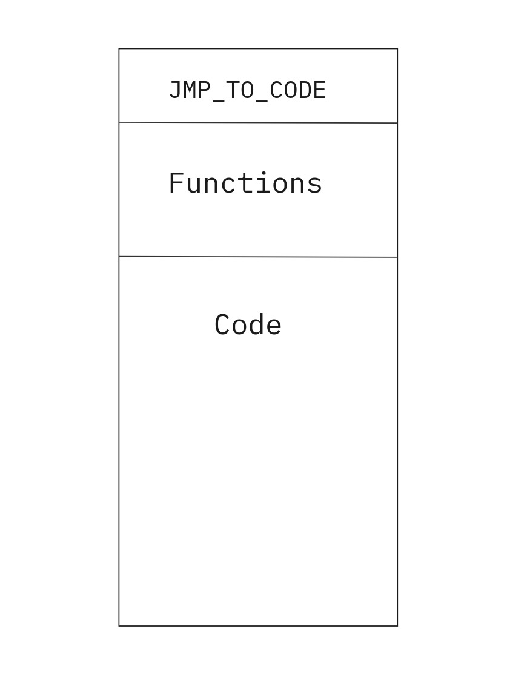

# larp

## Lisp-like language and RISC Processor emulator

Лагус Максим Сергеевич, Р33081

Вариант: `lisp | risc | harv | mc | tick | struct | stream | mem | cstr | prob5 | pipeline`

Без усложнения

## Language

### Syntax

```
program : expression+

?expression : atomic
           | if_expression
           | function
           | invokable

atomic : symbol
       | integer
       | string


function : "(" "defn" fun_name "(" args ")" fun_body ")"

fun_name : symbol
fun_body : expression+

invokable : "(" control args ")"
args : expression*

if_expression : "(" "if" condition if_body else_body? ")"
condition : expression
if_body : expression
else_body : expression

!control : symbol

symbol : NAME
integer : SIGN? DEC_NUMBER
string : STRING

SIGN : "-" | "+"
```

### Semantics

Language supports [original](ftp://publications.ai.mit.edu/ai-publications/pdf/AIM-008.pdf) _s-expressions_ semantics with a few tweaks:

- Each expression returns a value
- Each expression is only evaluated after all it's arguments are evaluated
- No special forms, function defines are expressions too
- False value is represented only by **ZERO**

### Variables

Language is dynamically typed, though it only supports string and integers

Strings are stored and passed as pointers, only converted to actual characters on ISA level on IO operations

There is only global scope to all variables and you don't need to define variable before the assigment

`(set variable_name (s-exp))` - set variable value as the result of the expression

### Control flow operations

Language doesn't support common loops with for/while instructions. Instead it offers _tail recursion optimization_ for functions, more on this in Translator section

`(if (condition) (then) (else))` - based on the evaluation result of conidition computes either then or else branches

### Operations

`(+, -, % (l_value) (r_value))` - computes math operation and returns the result

`(== (l_value) (r_value))` - compares values for integers and addresses for strings

### Functions

`(defn fun_name (arg1 arg2 ...) ([fun_body])` - defines function

`(fun_name arg1 arg2 ...)` - calls functions fun_name

`(ret (s-exp))` - evaluates expression and returns it as the result of function call

### IO

`(print (s-exp))` - prints the result of s-exp

`(read)` - returns the pointer to the new string

## Memory

Since we implement **Harward Architecture**, we split the memory to instructions and data memory

### Instruction memory

Implemented as high-level data structure, array of objects containing instructions and arguments for them



### Data memory

Linear address space with 32 bit machine word. Each word contains either signed integer, single char or address pointer. Different data types are distinguished only by instructions operating on them (no data tagging)

Integers and string pointers are stored sequentially in compile time, while strings have special memory space for them. Runtime input strings are mapped to the same string memory to static preallocated words (with offset considering max possible string length)

IO ports are statically mapped to specific data memory addresses. Instructions operate with them as with normal memory


### Registers

16 32-bit general purpose registers

- 8 for variables mapping
- 8 for s-expression arguments/computing/reserved

Second register group is callee saved

- Program counter - 32 bit
- Stack pointer - 32 bit

## ISA

### Architecture

- Machine word - 32 bit, signed
- 2-operand architecture, result stored in left register
- Register-Register architecture, data memory access with **load-store unit**
- No condition flags, `CMP` stores result in left register
- Direct memory addressing with `address` operand (both in data and instruction memories)
- Some instructions can get `address` operand from provided register, they are prefixed with _I_ (like [ra] in x86 asm )

### Instruction set

#### Data memory access

| Opcode |   arg1   |   arg2   |              description              |
| :----: | :------: | :------: | :-----------------------------------: |
|  LDR   | register | address  |       memory[`arg2`] -> `arg1`        |
|  ILDR  | register | register | same as `LDR`, but `arg2` is register |
|  STR   | register | register |       `arg1` -> memory[`arg2`]        |
|  PUSH  | register |          |        `arg1` -> stack[`SP`--]        |
|  POP   | register |          |        stack[`SP`++] -> `reg1`        |

#### Register operations

| Opcode |   arg1   |   arg2   |        description         |
| :----: | :------: | :------: | :------------------------: |
|  ADD   | register | register | `arg1` + `arg2` -> `arg1`  |
|  SUB   | register | register | `arg2` - `arg1` -> `arg1`  |
|  MOD   | register | register | `arg2` % `arg1` -> `arg1`  |
|  CMP   | register | register | `arg1` == `arg2` -> `arg1` |
|  MOV   | register | register |      `arg2` -> `arg1`      |

#### Branching

| Opcode |   arg1   |  arg2   |             description              |
| :----: | :------: | :-----: | :----------------------------------: |
|  JMP   | address  |         |            `arg1` -> `PC`            |
|  IJMP  | register |         | same as `JMP` but `arg1` is register |
|   JZ   | register | address |  if `arg1` == 0 then `arg2` -> `PC`  |

### Instruction example

```json
{
  "instruction_memory": [
    {
      "opcode": "LDR",
      "reg1": 11,
      "address": 0,
      "index": 4
    }
  ]
}
```

## Translator

### Phases

Translation happens in three phases:

- [Lexical analysis](/src/translator/grammar.lark) - using [lark](https://github.com/lark-parser/lark) parsing toolkit and _ebnf grammar_ file, split source file into terminal tokens, check syntax correctnes, apply production rules and then map terminals into expressions represented as internal data structures

- [Ast](/src/translator/larp_ast.py) - build ast, each node is inherited class with `codegen()` method and represent nonterminal symbol from the grammar. Using _lark transformers_, we inject metainformation in each node

- [Codegen](/src/translator/isa.py) - visit every node _top-down_ and generate instructions. Also generate data memory and perform string allocations

### Notes

#### Tail recursion optimization

There is _tail recursion optimization_ for functions, but it works with a few tweaks

- Assume recursion is always tail (call is the last expression)

- Store return address in register

#### Variables mapping

Up to 8 variables are mapped directly to registers and are stored there all execution time and cannot be unmapped. In case of more than 8 variables, we store them on stack and keep their address as stack pointer offset

### CLI

```bash
make poetry
ARGS="<input_file> <output_file>" make translator
# or
python3 -m src.translator.main <input_file> <output_file>
```

## Emulator

### Datapath


#### Signals

### Control unit

Handles microcode execution, contains premade read-only memory with microcode


### CLI

```bash
make poetry
ARGS="<input_file> <buffer> <output_file>" make emulator
# or
python3 -m src.emulator.main <input_file> <buffer> <output_file>
```

## Testing

`Test coverage is 71%`

All programs in [examples](/examples/) folder are tested and working correctly

There are [unit tests](/tests/unit_test.py) and [integrational tests](/tests/integration_test.py) in form of golden tests. Input values could be found in [golden](/golden/) folder

### CLI

```bash
make poetry
make test
make coverage
```

And update golden tests with:

```bash
make poetry
make update-golden
```

## CI

Gitlab Actions CI

```yaml
name: Nothing has broken

on: [push, pull_request]

jobs:
  quality:
    name: Nothing has broken
    runs-on: ubuntu-latest

    steps:
      - name: Check out the code
        uses: actions/checkout@v3

      - name: Set up Python 3.10
        uses: actions/setup-python@v3
        with:
          python-version: "3.10"

      - name: Install poetry
        run: python -m pip install poetry

      - name: Install dependencies
        run: poetry install

      - name: Lint with ruff
        run: make lint

      - name: Run tests and show coverage
        run: make coverage
```

Example of test run
```bash
poetry run coverage run -m pytest --verbose -vv
============================= test session starts ==============================
platform linux -- Python 3.10.12, pytest-7.4.3, pluggy-1.3.0 -- /home/kaladin/.cache/pypoetry/virtualenvs/larp-O-cp4rMj-py3.10/bin/python
cachedir: .pytest_cache
rootdir: /home/kaladin/IdeaProjects/larp
configfile: pyproject.toml
testpaths: tests
plugins: golden-0.2.2
collecting ... collected 7 items

tests/integration_test.py::test_ci PASSED                                [ 14%]
tests/integration_test.py::test_imports PASSED                           [ 28%]
tests/integration_test.py::test_golden_replace[../golden/simple.yaml] PASSED [ 42%]
tests/integration_test.py::test_translator[../golden/tr_cat.yaml] PASSED [ 57%]
tests/integration_test.py::test_translator[../golden/tr_hello.yaml] PASSED [ 71%]
tests/integration_test.py::test_translator[../golden/tr_if.yaml] PASSED  [ 85%]
tests/unit_test.py::test_building_ast PASSED                             [100%]

============================== 7 passed in 0.75s ===============================
poetry run coverage report -m
Name                         Stmts   Miss  Cover   Missing
----------------------------------------------------------
src/config/config.py            21      1    95%   20
src/emulator/cu.py              18      9    50%   13-14, 17-25
src/emulator/datapath.py        69     34    51%   23-30, 33, 37, 41-44, 47-52, 55, 60, 65, 68, 73-75, 78, 84, 87-88, 91, 96, 99, 105, 110
src/emulator/elements.py        91     35    62%   20, 23-26, 33, 36, 43, 53, 60, 63, 66, 69, 76, 79, 87, 90, 93, 104-105, 108, 111, 114-117, 120-123, 126, 129, 137, 140, 143-145
src/emulator/io.py              16      8    50%   11-12, 15-19, 22
src/emulator/main.py            23     15    35%   13-16, 22-35
src/emulator/microcode.py      106     40    62%   37-94
src/translator/isa.py           93     16    83%   20, 62-66, 69-70, 110, 115-130
src/translator/larp_ast.py     335     64    81%   16, 75, 84, 96-97, 107, 145, 154, 165, 197, 206, 209, 230, 233, 264, 272, 288-295, 339, 349, 374-382, 387-391, 397-398, 405-416, 420-434, 451, 453, 479-483, 490
src/translator/main.py          26     15    42%   18-30, 35-51
tests/integration_test.py       13      0   100%
tests/unit_test.py              10      0   100%
----------------------------------------------------------
TOTAL                          821    237    71%
```

